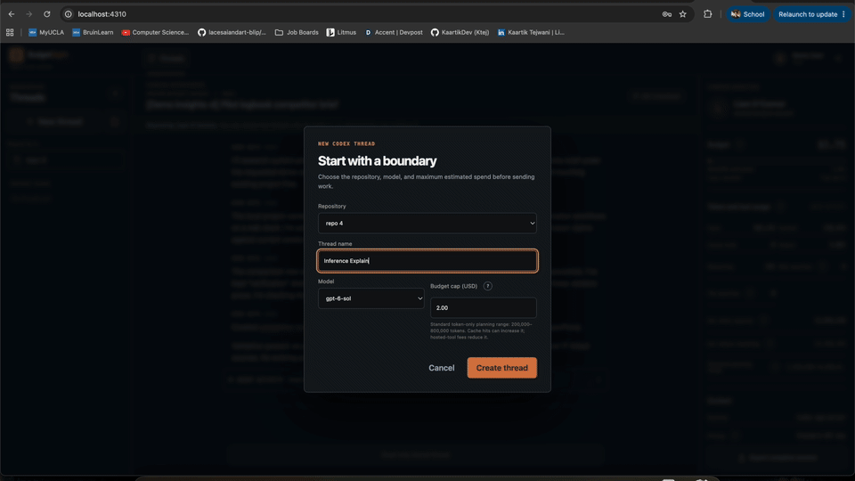
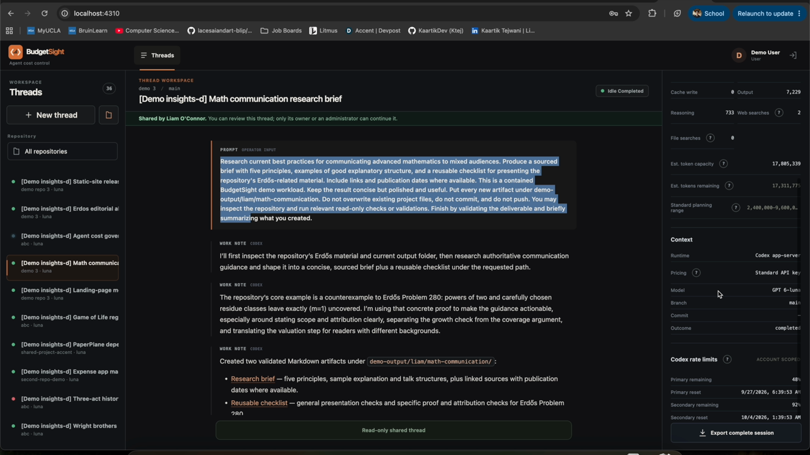
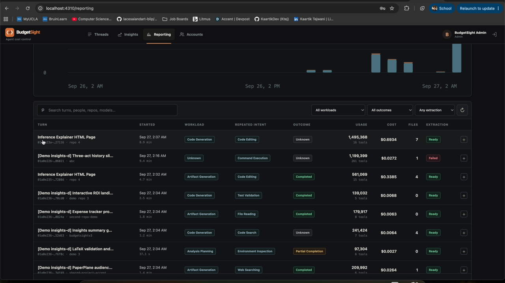
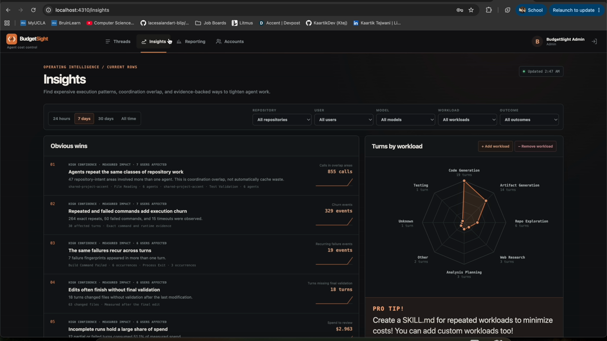
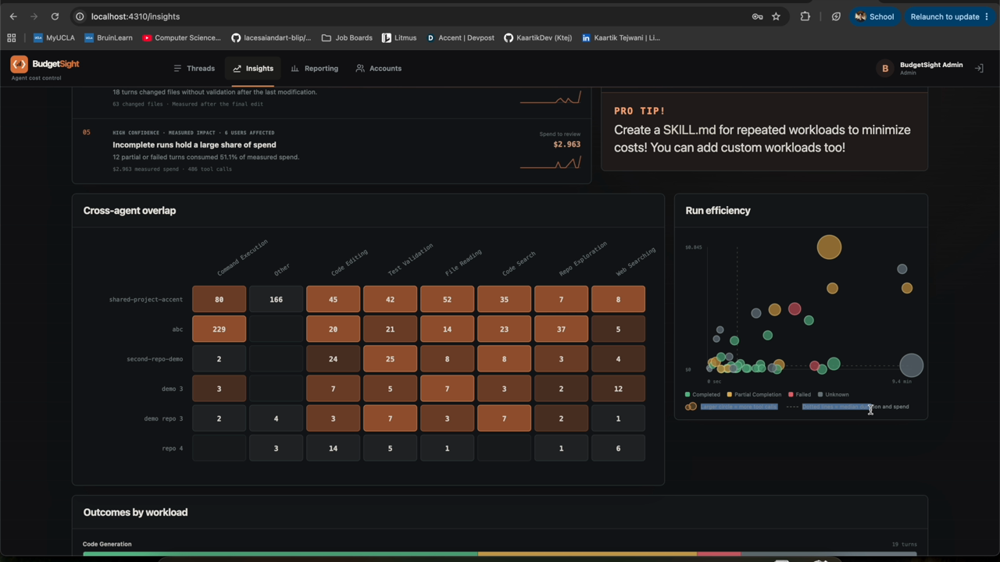

# BudgetSight

<p align="center">
  <strong>Local-first visibility into AI development work.</strong><br />
  Track Codex threads, token usage, spend, outcomes, and operational insights in one focused workspace.
</p>

<p align="center">
  
  
  
  
  
  
</p>

<p align="center">
  
</p>

## What it does

BudgetSight is a local-first product UI and audit layer for Codex app-server threads. It brings together the context that is usually scattered across terminals and dashboards:

- Thread timelines with raw Codex events and repository context
- Token usage, estimated Standard API spend, and per-thread dollar caps
- Turn Intelligence for workload, tool-intent, failure, and outcome analysis
- Insights dashboards for opportunity discovery and data-confidence signals
- Durable SQLite storage with resumable feature extraction

## Screenshots

### Thread workspace



### Turn Intelligence



### Insights



### Workload outcomes



## Tech stack

| Layer | Technology |
| --- | --- |
| Frontend | React, React Router, React Markdown, Vite |
| Backend | Node.js, Express, Codex app-server protocol |
| Data | SQLite, durable event store, versioned reporting rows |
| Intelligence | Deterministic feature extraction with optional Ollama (`qwen3:4b-instruct`) |
| Quality | Node test runner, Vitest, Testing Library |

---

BudgetSight is a local-first product UI and audit layer for Codex app-server threads. It tracks the person, repository, thread timeline, raw Codex events, token usage, account rate-limit metadata, and an estimated per-thread dollar cap.

## Requirements

- Node.js 24+
- A `codex` executable that supports `app-server`
- An existing Codex login (`codex login status`)
- [Ollama](https://ollama.com/) with `qwen3:4b-instruct` for semantic turn features (deterministic drafts work without it)

## Setup

```bash
cp .env.example .env
npm install
ollama pull qwen3:4b-instruct
npm run seed-defaults
npm run dev
```

Open `http://localhost:5173`. Repository choices come from `REPO_ROOTS`. Use the
repository button beside **New thread** to initialize a new Git repository inside
one of those allowed roots.

The local demo accounts are:

- Administrator: `admin` / `admin12345`
- Regular user: `demo` / `demo12345`
- Maya Chen: `maya.chen` / `Cedar!Sky27`
- Jordan Patel: `jordan.patel` / `Harbor!Mint42`
- Sofia Ramirez: `sofia.ramirez` / `Quartz!Lake56`
- Liam O'Connor: `liam.oconnor` / `Maple!River38`
- Aisha Thompson: `aisha.thompson` / `Nova!Field64`

These credentials are intended only for local development. Use `npm run seed-user`
to replace them with your own accounts before exposing the app to a network.

Do not open `apps/web/index.html` directly. Vite serves JavaScript modules and API
requests over HTTP, so a `file://` URL will fail with browser security-origin and
missing-resource errors.

For a production-style local launch, build first and then start the server:

```bash
npm run build
npm start
```

Then open `http://localhost:4310`.

## Turn feature extraction

Every terminal Codex turn is projected into a complete, versioned reporting row.
The deterministic draft is written even when Ollama is offline; Ollama classifies
the compact `workload`, per-tool `actions`, `failures`, and `outcome` extension.
The service then derives one structured `observations` object containing the most
repeated tool-call intent, its count, confidence, and evidence. Feature extraction
runs after the Codex turn and never blocks or changes the turn result.

Workloads use a controlled taxonomy: `code_generation`, `debugging`, `testing`,
`repo_exploration`, `web_research`, `artifact_generation`, `environment_setup`,
`deployment_operations`, `analysis_planning`, `other`, and `unknown`. Tool intents
use `repo_exploration`, `code_search`, `file_reading`, `code_editing`,
`test_validation`, `command_execution`, `environment_inspection`,
`dependency_setup`, `web_searching`, `version_control`, `artifact_inspection`, and
`other`.

Operational events, explicit turn boundaries, and durable extraction jobs live in
`DATA_DIR/budgetsight.db`. Immutable row versions live in the separate
`REPORTING_DB_PATH` SQLite database. `current_turn_feature_rows` exposes the latest
version for each turn. Reporting rows contain hashes and normalized metadata, not
raw prompts, assistant messages, full commands, or command output.

Backfill existing turns with:

```bash
npm run extract:backfill
npm run extract:backfill -- --task-id <task-id> --limit 100
npm run extract:backfill -- --turn-id <turn-id>
npm run extract:backfill -- --failed-only
```

Backfills are resumable and idempotent. Ollama outages leave schema-valid draft
rows current and move semantic jobs into `waiting_for_ollama`; the worker retries
without affecting Codex. Extraction lifecycle and failure events are appended as
JSON Lines to `FEATURE_EXTRACTION_LOG_PATH` (default:
`DATA_DIR/feature-extraction.log`). Admin-only reporting endpoints are:

- `GET /api/v1/admin/reporting/turns`
- `GET /api/v1/admin/reporting/turns/:turnId`
- `GET /api/v1/admin/reporting/turns/:turnId?versions=true`
- `POST /api/v1/admin/reporting/turns/:turnId/retry`

`GET /api/v1/health` includes worker, model-readiness, circuit-breaker, and job
counts. Set `FEATURE_EXTRACTION_ENABLED=false` to disable automatic extraction.

For a user-facing explanation of the admin Insights page, its charts, opportunity
rules, and data-confidence signals, see [Insights documentation](docs/INSIGHTS.md).

## Demo Insights workload generator

Generate a repeatable Insights dataset with five named demo users and 25 Luna
threads. The launcher runs five tasks in parallel per wave, rotates repositories
to respect the one-active-turn-per-repository lock, and assigns caps from $0.50 to
$2.50. Preview the matrix or run it against a local BudgetSight server with:

```bash
npm run demo:workloads -- --dry-run
npm run demo:workloads -- --run-id=my-demo-run
```

The default per-task timebox is eight minutes. Override it with
`DEMO_TASK_TIMEOUT_MS`; use `BUDGETSIGHT_URL` when the server is not at
`http://127.0.0.1:4310`. Run manifests are written to
`data/demo-workload-runs/`.

## Important security note

BudgetSight starts one local Codex app-server process and creates persistent Codex
threads with a `workspace-write` sandbox rooted in the selected repository. This is
still a local developer tool rather than a production multi-tenant security
boundary. Use trusted accounts and repositories and review Git changes.

## Budget behavior

BudgetSight always estimates **Standard OpenAI API-key billing in USD**, even when
the local Codex app-server is authenticated through ChatGPT. It never applies the
Codex/ChatGPT credit rate card. This makes the dollar cap stable and comparable
across installations, but it is an estimate rather than a ChatGPT subscription or
credit invoice.

For each `thread/tokenUsage/updated` notification, BudgetSight prices the
per-response `tokenUsage.last` fields and accumulates them for the thread:

```text
estimated spend =
  uncached input × input rate
  + cached input × cached-input rate
  + cache-write input × cache-write rate
  + output × output rate
  + completed hosted-tool call fees
```

Cached and cache-write tokens are already included in input tokens, so they are
subtracted before the ordinary uncached-input amount is calculated. Reasoning tokens
are already included in output tokens and are not added a second time. Cache-write
pricing is a mutually exclusive input category, not an extra surcharge.

BudgetSight also scans completed app-server items for separately billed hosted API
tools. Web-search `search` actions add $0.01 per completed call, and file-search
calls add $0.0025 each. Search-result content tokens are already present in the
model input usage and therefore are not added a second time. Local app-server shell
commands, browser control, and MCP calls do not add an API tool fee because they are
not OpenAI-hosted API tools.

Current Standard API list rates per one million tokens:

| Model | Input | Cached input | Cache write | Output |
| --- | ---: | ---: | ---: | ---: |
| GPT-6 Astra | $10.00 | $1.00 | $12.50 | $50.00 |
| GPT-6 Sol | $2.00 | $0.20 | $2.50 | $10.00 |
| GPT-6 Luna | $0.10 | $0.01 | $0.125 | $0.50 |

When one model response has more than 272,000 input tokens, BudgetSight applies that
model's long-context rates to the entire response: 2× input, cached-input, and
cache-write rates, and 1.5× output rates. The threshold is evaluated per response,
not against cumulative thread input. Existing stored threads are repriced from their
raw per-response usage and completed tool events when the server starts after a
pricing-version change.

The cap is best-effort because Codex reports usage asynchronously. BudgetSight
interrupts the active app-server turn when the accumulated estimate reaches the cap,
blocks follow-up work until the cap is increased, and reports any overrun. The token
planning range shown before a run uses short-context Standard rates and is
informational; the live dollar estimate is the enforcement value.

The estimate does not include regional-processing premiums, Fast mode, Batch/Flex
discounts, negotiated rates, taxes, storage charges, or delayed billing adjustments.
The local app-server runtime does not create billable hosted-shell or Code
Interpreter containers. If per-response history is unavailable, BudgetSight falls
back to the cumulative token totals at short-context Standard rates and preserves
the best-effort label.

Pricing references:

- [GPT-6 Sol model pricing](https://developers.openai.com/api/docs/models/gpt-6-sol)
- [OpenAI API pricing](https://developers.openai.com/api/docs/pricing)
- [Prompt caching](https://developers.openai.com/api/docs/guides/prompt-caching)
- [Codex app-server protocol](https://learn.chatgpt.com/docs/app-server)
