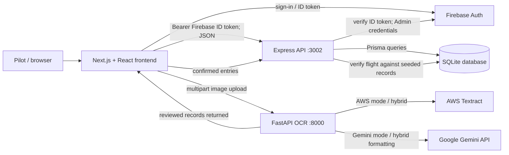

# PaperPlane | Dependency & Integration Risk Map

**Scope:** package manifests, service entry points, API clients, Prisma schema, and OCR providers. Risk ratings reflect the visible code and configuration; runtime deployment controls were not inspected.

## Ranked risks

| Rank | Risk | Why it matters / evidence | Priority |
|---|---|---|---|
| **1** | **OCR endpoint is unauthenticated and broadly exposed** | `POST /ocr/process` accepts images without user authentication; FastAPI enables wildcard CORS with credentials. Uploads may contain sensitive logbook data and invoke metered Textract/Gemini calls. | **Critical** — restrict origins, authenticate/rate-limit uploads, and cap request size at the edge as well as application level. |
| **2** | **Firebase Admin credentials are a hard startup dependency** | Express imports `server/serviceAccountKey.json` directly. Missing/invalid credentials can prevent API startup; distributing a service-account key creates a high-impact secret-management risk. | **High** — load credentials via managed identity or secret injection and fail with a clear startup check. |
| **3** | **Authentication is not consistently applied to API routes** | Most flight-entry/CSV routes use `requireUser`, but `POST /api/v1/verify/` has no auth or ownership middleware. A caller may trigger verification or mutate an entry by ID if the controller trusts the body. | **High** — require identity and prove entry ownership inside the verification path. |
| **4** | **OCR depends on external vendor credentials, availability, and parsing quality** | Default provider is AWS Textract; Gemini and hybrid modes are also supported. Hybrid requires both Textract and Gemini. Provider calls are synchronous from upload, while OCR returns guessed fields that are reviewed before saving. | **High** — provider outages/quotas block imports; parsing can silently normalize unreadable values. Add timeouts/retries, telemetry, and confidence/uncertainty handling. |
| **5** | **SQLite and service configuration constrain deployment portability** | Prisma schema pins SQLite; database URL, Firebase key, OCR provider keys, and frontend service URLs are configured separately. Frontend defaults to localhost ports 3002/8000, while API CORS explicitly allows only localhost:3000. | **Moderate-High** — production origins and service URLs can drift; SQLite concurrency/volume behavior may not suit multi-instance deployment. Validate environment configuration at startup and document deployment topology. |

## Dependency and integration map

| Area | Implementation / dependencies | Main integration edge |
|---|---|---|
| Frontend | Next.js 16, React 19, Firebase Web SDK | Browser → Express JSON API (Bearer Firebase ID token); browser → FastAPI multipart OCR upload |
| API | Express 5, TypeScript, Zod, Firebase Admin SDK | Verifies Firebase tokens; scopes most logbook/CSV operations through Prisma |
| Database | Prisma 6, SQLite; `User`, `FlightEntry`, `Flight` | Local persistence; seeded `Flight` records back verification matching |
| Authentication | Firebase Auth client + Firebase Admin token verification | Firebase identity → SHA-256 email hash → local User record (just-in-time provisioned) |
| OCR | FastAPI, Pydantic, boto3, google-genai | AWS Textract table extraction; optional Gemini extraction or Textract→Gemini hybrid; returns records to browser for review then save through API |
| External services | Firebase, AWS Textract, Google Gemini | Credentials, quotas, network availability, data handling, and vendor response formats are operational dependencies |

## Mermaid dependency diagram

## Manifest and structure notes

- The root manifest owns frontend tooling and convenience scripts for all three services; the server has a separate manifest, and OCR pins Python packages in `ocr/requirements.txt`.
- Root dependencies include Prisma client/tooling despite the API-owning server package not declaring them. This makes install/build behavior sensitive to running from the repository root.
- README badges describe older versions (Next 14 / React 18 / Express 4 / Prisma 5), while manifests currently specify Next 16 / React 19 / Express 5 / Prisma 6.
- `build:all` invokes `build:ocr`, but no `build:ocr` script is declared in the root manifest. Treat this as a broken advertised aggregate build path.
- Verification data is stored locally in SQLite and loaded by seed scripts; the inspected request path does not show a live external aviation-data API.

**Suggested first checks:** protect and scope OCR/verification routes; remove committed/file-coupled credentials from startup; then validate deployment env vars and the advertised aggregate build workflow.
