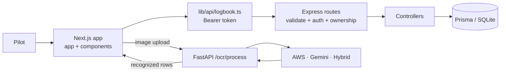

# PaperPlane: contributor onboarding map

PaperPlane is a pilot logbook with a **Next.js/React** web app, an **Express + Prisma** API, and a **FastAPI** OCR service. Start with `PaperPlane/README.md` for setup; `PaperPlane/LOCAL_SNAPSHOT.md` explains that this workspace is a source snapshot rather than a Git clone.

## Where things live

| Path | What you’ll find |
| --- | --- |
| `PaperPlane/app/` | Next.js routes: landing, login/signup, and dashboard. The dashboard coordinates logbook, OCR, CSV, and verification actions. |
| `PaperPlane/components/` and `context/` | Reusable UI (especially `components/dashboard/`) and Firebase auth state. |
| `PaperPlane/lib/` and `types/` | Browser API clients, URL config, OCR review helpers, error handling, and shared logbook types. |
| `PaperPlane/server/src/` | Express app, route table, validation/auth middleware, controllers, schemas, and verification logic. `server/prisma/` holds the data model and migrations; `server/scripts/` has seed/data utilities. |
| `PaperPlane/ocr/` | FastAPI entry point, pluggable OCR processors (AWS, Gemini, hybrid), and image/date utilities. |
| `PaperPlane/tests/` | Frontend unit tests, Playwright browser tests, and Firebase mocks. |
| `PaperPlane/server/test/` | Vitest + Supertest integration tests, fixtures, and setup. |
| `PaperPlane/ocr/tests/` | Pytest tests for the OCR API. |
| `PaperPlane/features/` | Cucumber feature scenarios, step definitions, and shared test support. |
| `PaperPlane/public/`, `data/`, `notes/` | Static assets/docs, sample flight data, and project notes. |

## Request flow

For a saved flight, the dashboard gets the Firebase ID token, `lib/api/logbook.ts` sends it as a Bearer token, and Express routes validate input and call `requireUser`. Entry-by-ID routes also check ownership before reaching a controller. Controllers read/write through Prisma. OCR is a separate path: browser uploads an image directly to FastAPI, reviews returned rows, then saves confirmed entries through the API. CSV preview/import/export and verification are API routes.

## Three good first tasks

1. **Add focused API auth/ownership cases.** Extend `server/test/integration/flight-entry.test.ts` to cover missing/invalid tokens and PATCH ownership, following its existing fixture/cleanup patterns. This teaches the route → middleware → controller boundary.
2. **Exercise OCR review failure and retry behavior end to end.** The helper already has unit coverage in `tests/unit/ocrReview.test.mjs`; add a Playwright flow in `tests/playwright/` for correcting/discarding a row and retrying a failed save without resubmitting successful rows. The workflow spans dashboard, modal, and API client.
3. **Polish one dashboard interaction with regression coverage.** Pick a contained improvement in `components/dashboard/` (for example, clear feedback when CSV preview has no importable rows), then cover the visible result in Playwright. Keep API behavior and UI expectations aligned with `server/test/integration/csv.test.ts`.

Useful test commands from `PaperPlane/`: `npm run test:server`, `npm run test:ocr-review`, `npm run test:ocr`, and `npx playwright test` (app/services and browser setup may be needed for integration/E2E runs). See the root scripts in `package.json` for orchestration commands.
